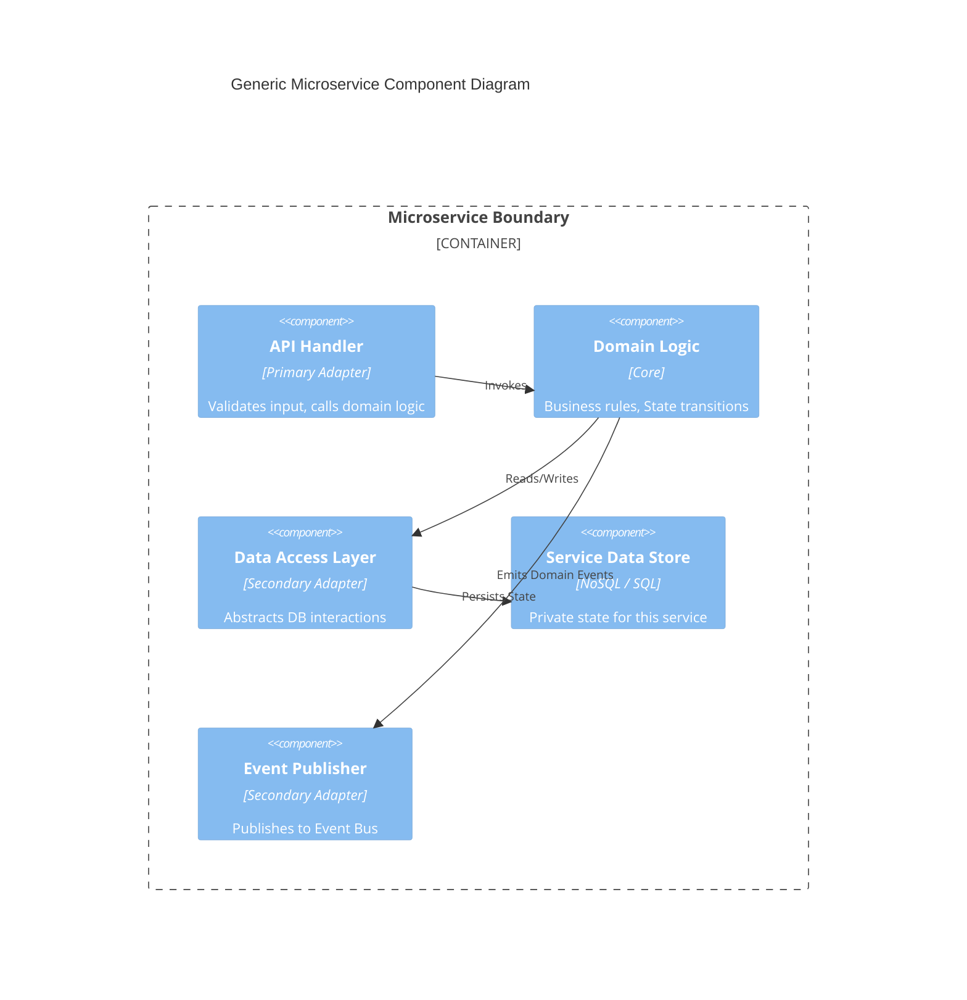

# Adopt Microservices Architecture

## Status

Accepted

## Context

The SaaS Foundation Platform aims to provide a robust, scalable foundation for future applications.
However, the development and operations team size is limited.
Minimizing the "undifferentiated heavy lifting" of infrastructure management is a critical success factor.

We need an architecture that allows us to:

1. Drastically reduce operational overhead (NoOps / LowOps).
2. leverage "best-of-breed" managed services for standard functions (e.g., Auth, Billing) rather than building them from scratch.
3. Scale different domains (e.g., high-traffic public API vs. low-traffic internal admin) independently.

## Decision

We will adopt a **Microservices Architecture**, implemented primarily through **Event-Driven Serverless Components** and **Managed Services**.

Rules:

1. **Managed Service First**: We will prefer fully managed services (SaaS/PaaS) over self-hosted components.
2. **Function as a Service (FaaS)**: Custom logic will be deployed as stateless functions (e.g., AWS Lambda) to eliminate server management.
3. **Event-Driven**: Services will decouple via an Event Bus to allow independent evolution and scaling.

## Rationale

Primary: **Operational Efficiency (NoOps)**
    By adopting a microservices style where each "service" maps closely to a managed cloud resource (e.g., Auth Service -> Cognito, API Layer -> API Gateway), we shift the burden of availability, patching, and scaling to the cloud provider.

Secondary: **Scalability & Isolation**
    The "Control Plane" has distinct scaling profiles. Authentication and Tenant Resolution must be extremely low latency and high availability, whereas Billing is asynchronous and bursty. Microservices allow applying the right tool (and cost structure) to the right problem.

## Consequences

Positive:

- Significant reduction in infrastructure maintenance tasks.
- Ability to use "best-for-job" managed services (e.g., DynamoDB for high-scale, RDS for relational).

Negative:

- **Integration Complexity**: Debugging across distributed services is harder; requires robust Distributed Tracing (see FR-LOG).
- **Vendor Lock-in**: Heavy reliance on specific managed services makes porting to another cloud provider difficult (accepted risk).

## Internal Structure

To ensure testability and consistency across microservices, we enforce a standard **Layered / Hexagonal Architecture**.

**Decision**:
All microservices SHALL be structured with the following layers:

1. **Transport / Adapter Layer (API Handler)**

- Responsibility: Receive events (HTTP/EventBridge), validate input, invoke Domain Logic.
- Technology: AWS Lambda Handler, API Gateway integration.

2. **Domain Logic Layer (Core)**

- Responsibility: Implement business rules, state transitions, and invariants.
- Constraint: **PURE CODE**. No dependencies on AWS SDKs or external frameworks.

3. **Data Access / Infrastructure Layer (Repository)**

- Responsibility: Persist state, publish events, call external APIs.
- Technology: DynamoDB SDK, HTTP Clients.

**Component Diagram**:

