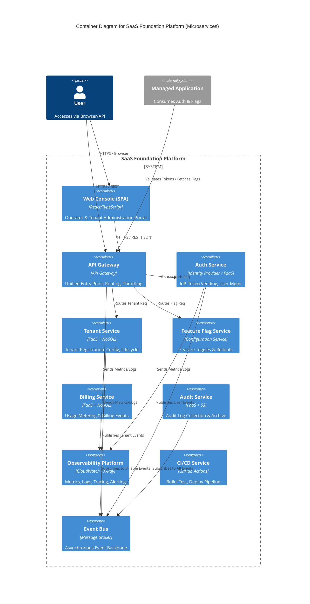

# Building Block View

This section decomposes the system into its building blocks (modules, components).
The architecture follows a **Microservices** approach utilizing **Managed Services** (see [../../adr/decisions/architecture-style](../../adr/decisions/architecture-style.md)).

## Level 1: System Whitebox (Container View)

## Component Description

### Web Console (SPA)

* **Responsibility**: Single Page Application providing Administrative interfaces for Operators and Tenants.
* **Related FRs**:
  * [IF-OPS-CONSOLE (Operator Console)](../../spec/interface-requirements/ui.md#IF-OPS-CONSOLE)
  * [IF-TENANT-CONSOLE (Tenant Administration Console)](../../spec/interface-requirements/ui.md#IF-TENANT-CONSOLE)
  * [IF-AUDIT-CONSOLE (Auditor Console)](../../spec/interface-requirements/ui.md#IF-AUDIT-CONSOLE)
  * [IF-LOGIN-UI (Universal Login Page)](../../spec/interface-requirements/ui.md#IF-LOGIN-UI)
* **Related NFRs**:
  * [NFR-PERF-003 (UI Responsiveness)](../../spec/non-functional-requirements/performance.md#NFR-PERF-003)

### API Gateway

* **Responsibility**: Entry point for all external requests. Handles routing, rate limiting, and authentication offloading.
* **Related FRs**:
  * [FR-SYS-002 (API Key Management)](../../spec/functional-requirements/system-ops.md#FR-SYS-002)
* **Related NFRs**:
  * [NFR-OPS-003 (Load Balancing and Failover)](../../spec/non-functional-requirements/availability.md#NFR-OPS-003)
  * [NFR-PERF-001 (Authentication Latency)](../../spec/non-functional-requirements/performance.md#NFR-PERF-001)

### Auth Service

* **Responsibility**: Manages user identities and credentials via External IdP.
* **Related FRs**:
  * [FR-AUTH-001 (Supported Authentication Methods)](../../spec/functional-requirements/auth.md#FR-AUTH-001)
  * [FR-AUTH-003 (Tenant SSO Configuration)](../../spec/functional-requirements/auth.md#FR-AUTH-003)
  * [FR-AUTH-004 (Password Reset)](../../spec/functional-requirements/auth.md#FR-AUTH-004)
  * [FR-AUTH-005 (Session Management)](../../spec/functional-requirements/auth.md#FR-AUTH-005)
  * [FR-AUTH-006 (Password Policy Configuration)](../../spec/functional-requirements/auth.md#FR-AUTH-006)
* **Related NFRs**:
  * [NFR-SEC-003 (Multi-Factor Authentication)](../../spec/non-functional-requirements/security.md#NFR-SEC-003)
  * [NFR-SEC-006 (Adaptive Authentication)](../../spec/non-functional-requirements/security.md#NFR-SEC-006)
  * [NFR-CAP-002 (User Scalability)](../../spec/non-functional-requirements/capacity.md#NFR-CAP-002)

### Tenant Service

* **Responsibility**: Manages Tenant lifecycle (onboarding, configuration, suspension).
* **Related FRs**:
  * [FR-TENANT-001 (User Invitation)](../../spec/functional-requirements/tenant-admin.md#FR-TENANT-001)
  * [FR-TENANT-002 (User Deletion)](../../spec/functional-requirements/tenant-admin.md#FR-TENANT-002)
  * [FR-TENANT-003 (Contract Modification)](../../spec/functional-requirements/tenant-admin.md#FR-TENANT-003)
  * [FR-TENANT-004 (User Role Management)](../../spec/functional-requirements/tenant-admin.md#FR-TENANT-004)
  * [FR-TENANT-006 (User Status Management)](../../spec/functional-requirements/tenant-admin.md#FR-TENANT-006)
  * [FR-TENANT-007 (Invitation Resend)](../../spec/functional-requirements/tenant-admin.md#FR-TENANT-007)
  * [FR-OPS-001 (Tenant Status Management)](../../spec/functional-requirements/platform-ops.md#FR-OPS-001)
  * [FR-OPS-002 (Tenant Deletion)](../../spec/functional-requirements/platform-ops.md#FR-OPS-002)
  * [FR-SYS-004 (Operator JIT Provisioning)](../../spec/functional-requirements/system-ops.md#FR-SYS-004)
* **Related NFRs**:
  * [NFR-CAP-001 (Tenant Scalability)](../../spec/non-functional-requirements/capacity.md#NFR-CAP-001)
  * [NFR-DATA-001 (Data Residency)](../../spec/non-functional-requirements/data.md#NFR-DATA-001)

### Feature Flag Service

* **Responsibility**: Delivers dynamic configuration and feature toggles to the Application.
* **Related FRs**:
  * [FR-FLAG-001 (Flag Configuration)](../../spec/functional-requirements/feature-flags.md#FR-FLAG-001)
  * [FR-FLAG-002 (Flag Delivery)](../../spec/functional-requirements/feature-flags.md#FR-FLAG-002)
* **Related NFRs**:
  * [NFR-PERF-002 (API Latency)](../../spec/non-functional-requirements/performance.md#NFR-PERF-002)

### Billing Service

* **Responsibility**: Aggregates usage metrics and interfaces with external Billing System.
* **Related FRs**:
  * [FR-BILL-001 (Billing Event Persistence)](../../spec/functional-requirements/billing.md#FR-BILL-001)
  * [FR-BILL-002 (Billing Event Ingestion)](../../spec/functional-requirements/billing.md#FR-BILL-002)
  * [FR-BILL-003 (Billing Data Export)](../../spec/functional-requirements/billing.md#FR-BILL-003)
* **Related NFRs**:
  * [NFR-OPS-004 (Backup and Redundancy)](../../spec/non-functional-requirements/availability.md#NFR-OPS-004)

### Audit Service

* **Responsibility**: Ingests and archives security and operational logs.
* **Related FRs**:
  * [FR-LOG-001 (Audit Log Collection)](../../spec/functional-requirements/audit.md#FR-LOG-001)
  * [FR-LOG-002 (Audit Log Export)](../../spec/functional-requirements/audit.md#FR-LOG-002)
  * [FR-LOG-003 (Control Plane Auditing)](../../spec/functional-requirements/audit.md#FR-LOG-003)
  * **Related NFRs**:

    * [NFR-MON-001 (Continuous Monitoring)](../../spec/non-functional-requirements/monitoring.md#NFR-MON-001)

### Observability Platform

* **Responsibility**: Centralized collection and visualization of Metrics, Logs, and Traces. Handles Alerting and Synthetics.
* **Related FRs**:
  * [FR-SYS-005 (System Health Monitoring)](../../spec/functional-requirements/system-ops.md#FR-SYS-005)
* **Related NFRs**:
  * [NFR-MON-002 (System Health Alerting)](../../spec/non-functional-requirements/monitoring.md#NFR-MON-002)
  * [NFR-MON-003 (Synthetic Monitoring)](../../spec/non-functional-requirements/monitoring.md#NFR-MON-003)
  * [NFR-MON-001 (Continuous Monitoring)](../../spec/non-functional-requirements/monitoring.md#NFR-MON-001)

### CI/CD Service

* **Responsibility**: Automation of Build, Test, Security Scanning, and Deployment processes.
* **Related NFRs**:
  * [NFR-OPS-001 (Service Level Objective)](../../spec/non-functional-requirements/availability.md#NFR-OPS-001) (Deployment Safety)
* **Decision**: [../../adr/decisions/cicd-platform](../../adr/decisions/cicd-platform.md)

### Event Bus

* **Responsibility**: Asynchronous message broker for decoupling services (Publish/Subscribe pattern).
* **Related FRs**:
  * Infrastructure component supporting all Event-Driven FRs.
* **Related NFRs**:
  * [NFR-OPS-003 (Load Balancing and Failover)](../../spec/non-functional-requirements/availability.md#NFR-OPS-003)

## Internal Structure

The internal structure of each microservice follows a standard **Layered / Hexagonal Architecture** to ensure testability and consistency.
For the detailed component pattern, see [../../adr/decisions/architecture-style](../../adr/decisions/architecture-style.md).
