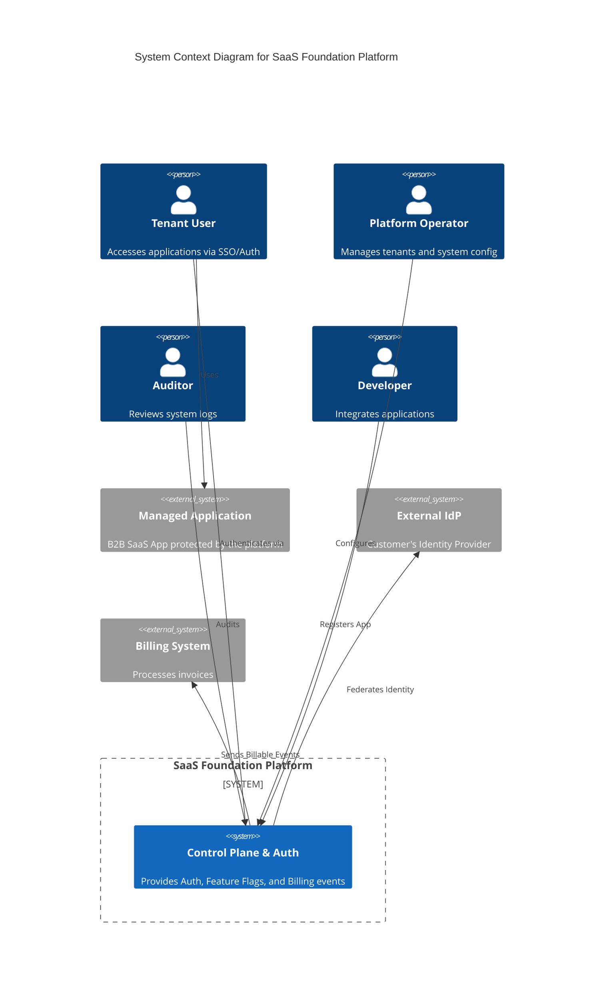

# Context View

This section describes the system's boundaries and interactions with external actors and systems.

## System Context Diagram (level 1)

## External Elements

The following actors and systems interact with the SaaS Foundation Platform.

### Actors

#### Tenant User

[ACT-USER (Tenant User)](../../spec/actors/list.md#ACT-USER)

#### Platform Operator

[ACT-OPS (Platform Operator)](../../spec/actors/list.md#ACT-OPS)

#### Auditor

[ACT-AUDIT (Auditor)](../../spec/actors/list.md#ACT-AUDIT)

#### Developer

[ACT-DEV (Developer)](../../spec/actors/list.md#ACT-DEV)

### External Systems

#### Managed Application

[TERM-APP-TARGET (Managed Application)](../../spec/terminology/definitions.md#TERM-APP-TARGET)

#### External Billing System

[ACT-BILLING (External Billing System)](../../spec/actors/list.md#ACT-BILLING)

#### External Identity Provider

OIDC-compliant IdP (e.g., Azure Entra ID).

* See [../../adr/decisions/authentication-provider](../../adr/decisions/authentication-provider.md).

## Scope Boundaries

* **In-Scope**: Authentication, Feature Flags, Logging (See [Scope](../../spec/scope/boundaries.md)).
* **Out-of-Scope**: Payment Processing, Operator IdP Management.
