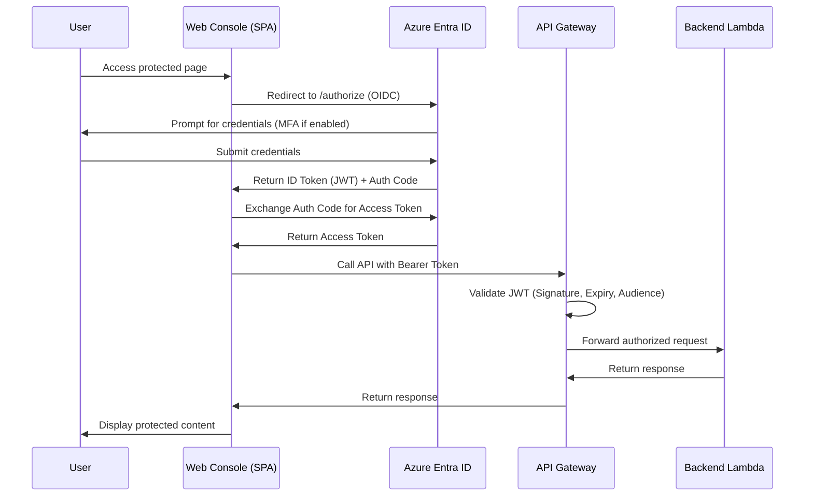
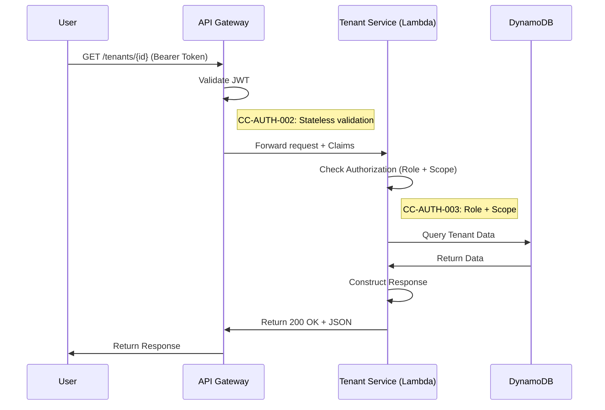
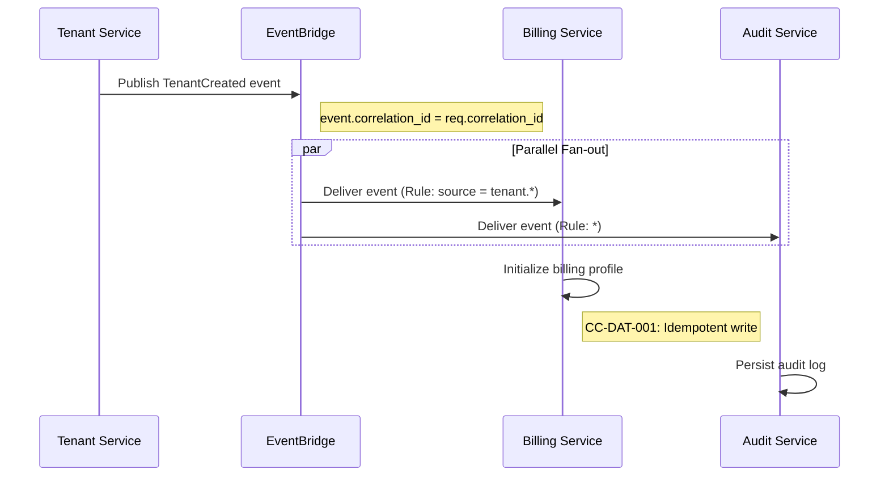
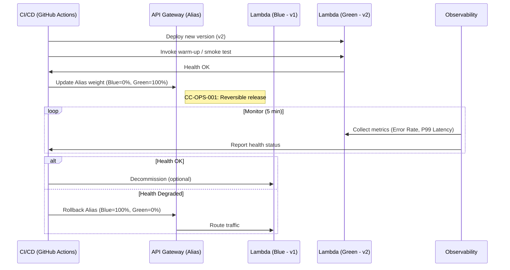
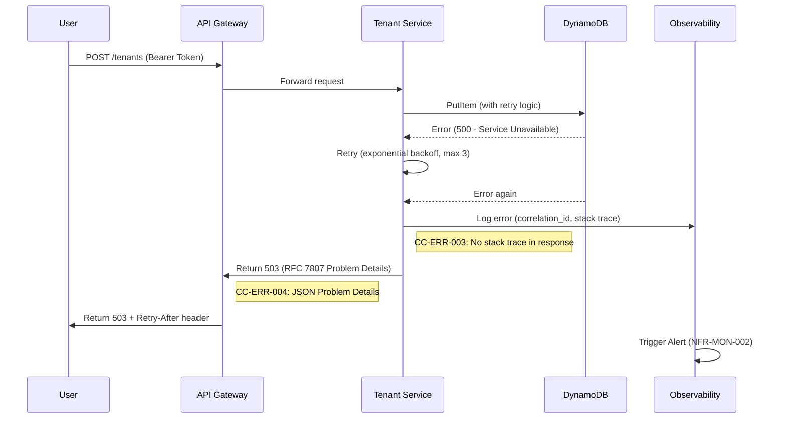

# Runtime View

This section describes concrete behavior and interactions between building blocks in the form of **scenarios**.
Each scenario shows the "time-axis story" of how components collaborate to fulfill a requirement, governed by Cross-Cutting rules.

## RT-001 User Login (OIDC)

### Scenario

A user authenticates via the external Identity Provider (Azure Entra ID) and gains access to the Web Console.

### Actors
* [User](../../spec/actors/list.md#ACT-USER)
* [Web Console (SPA)](building-block-view.md#BB-UI-001)
* [Auth Service (External IdP)](building-block-view.md#BB-AUTH-001)
* [API Gateway](building-block-view.md#BB-API-001)

### Flow

### Cross-cutting
* [CC-AUTH-001](cross-cutting-concepts.md#CC-AUTH-001) (Delegate Auth to External IdP)
* [CC-AUTH-002](cross-cutting-concepts.md#CC-AUTH-002) (Stateless JWT validation)
* [CC-LOG-001](cross-cutting-concepts.md#CC-LOG-001) (Correlation ID propagated)

### Requirements
* [FR-AUTH-001](../../spec/functional-requirements/auth.md#FR-AUTH-001) (Supported Authentication Methods)
* [NFR-PERF-001](../../spec/non-functional-requirements/performance.md#NFR-PERF-001) (Authentication Latency)

----

## RT-002 Authenticated API Request

### Scenario

An authenticated user makes a REST API call to retrieve tenant information.

### Actors
* [User](../../spec/actors/list.md#ACT-USER)
* [API Gateway](building-block-view.md#BB-API-001)
* [Tenant Service](building-block-view.md#BB-TNT-001)

### Flow

### Cross-cutting
* [CC-AUTH-002](cross-cutting-concepts.md#CC-AUTH-002) (Stateless JWT)
* [CC-AUTH-003](cross-cutting-concepts.md#CC-AUTH-003) (Role + Scope Authorization)
* [CC-LOG-001](cross-cutting-concepts.md#CC-LOG-001) (Correlation ID)
* [CC-API-001](cross-cutting-concepts.md#CC-API-001) (REST + JSON)

### Requirements
* [FR-TENANT-001](../../spec/functional-requirements/tenant-admin.md#FR-TENANT-001) (User Invitation / Tenant context)
* [NFR-PERF-002](../../spec/non-functional-requirements/performance.md#NFR-PERF-002) (API Latency)

----

## RT-003 Async Event Processing

### Scenario

A domain event (e.g., `TenantCreated`) is published and consumed by multiple services asynchronously.

### Actors
* [Tenant Service](building-block-view.md#BB-TNT-001)
* [Event Bus](building-block-view.md#BB-EVT-001)
* [Billing Service](building-block-view.md#BB-BIL-001)
* [Audit Service](building-block-view.md#BB-AUD-001)

### Flow

### Cross-cutting
* [CC-LOG-001](cross-cutting-concepts.md#CC-LOG-001) (Correlation ID propagation)
* [CC-DAT-001](cross-cutting-concepts.md#CC-DAT-001) (Idempotent writes)
* [CC-DAT-002](cross-cutting-concepts.md#CC-DAT-002) (Eventual Consistency)

### Requirements
* [FR-BILL-002](../../spec/functional-requirements/billing.md#FR-BILL-002) (Billing Event Ingestion)
* [FR-LOG-001](../../spec/functional-requirements/audit.md#FR-LOG-001) (Audit Log Collection)
* [NFR-OPS-003](../../spec/non-functional-requirements/availability.md#NFR-OPS-003) (Failover / Event Delivery)

----

## RT-004 Blue-Green Switchover

### Scenario

A new version is deployed to Production using Blue-Green deployment. Traffic is switched from Blue (old) to Green (new).

### Actors
* [CI/CD Service](building-block-view.md#BB-CICD-001)
* [API Gateway](building-block-view.md#BB-API-001)
* [Observability Platform](building-block-view.md#BB-OBS-001)

### Flow

### Cross-cutting
* [CC-OPS-001](cross-cutting-concepts.md#CC-OPS-001) (Reversible release)
* [CC-OPS-002](cross-cutting-concepts.md#CC-OPS-002) (Immutable artifact)
* [CC-OBS-001](cross-cutting-concepts.md#CC-OBS-001) (SLI/SLO driven)

### Requirements
* [NFR-OPS-001](../../spec/non-functional-requirements/availability.md#NFR-OPS-001) (Availability SLO)
* [NFR-OPS-002](../../spec/non-functional-requirements/availability.md#NFR-OPS-002) (MTTR)

----

## RT-005 Error Handling Flow

### Scenario

An API request fails due to a downstream service error. The system logs the error, returns a structured response, and retries if applicable.

### Actors
* [User](../../spec/actors/list.md#ACT-USER)
* [API Gateway](building-block-view.md#BB-API-001)
* [Tenant Service](building-block-view.md#BB-TNT-001)
* [Observability Platform](building-block-view.md#BB-OBS-001)

### Flow

### Cross-cutting
* [CC-ERR-001](cross-cutting-concepts.md#CC-ERR-001) (Map to HTTP codes)
* [CC-ERR-002](cross-cutting-concepts.md#CC-ERR-002) (Business vs System errors)
* [CC-ERR-003](cross-cutting-concepts.md#CC-ERR-003) (No stack trace exposure)
* [CC-ERR-004](cross-cutting-concepts.md#CC-ERR-004) (RFC 7807)
* [CC-LOG-001](cross-cutting-concepts.md#CC-LOG-001) (Correlation ID)

### Requirements
* [NFR-OPS-001](../../spec/non-functional-requirements/availability.md#NFR-OPS-001) (Availability SLO)
* [NFR-MON-002](../../spec/non-functional-requirements/monitoring.md#NFR-MON-002) (System Health Alerting)
